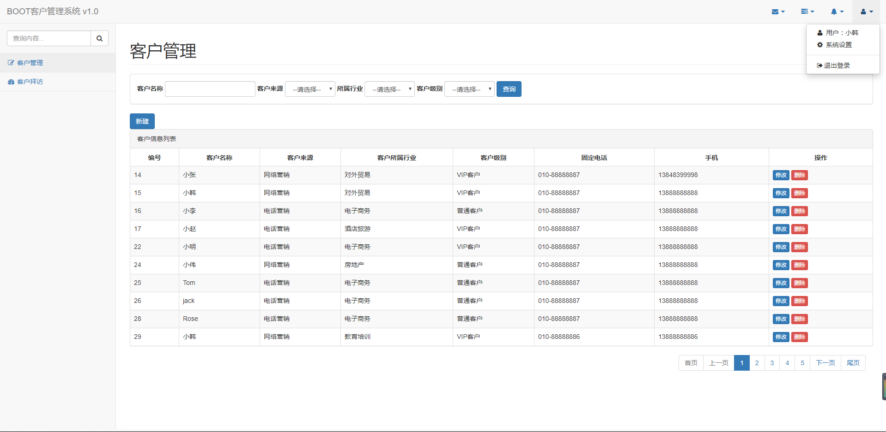
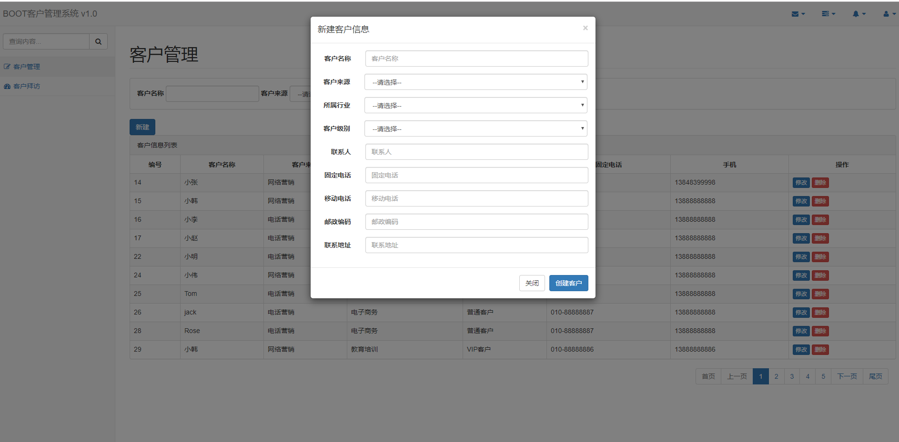
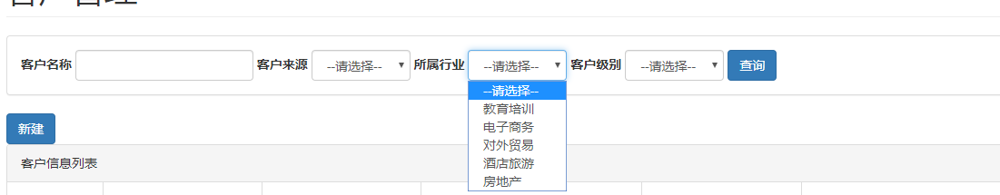
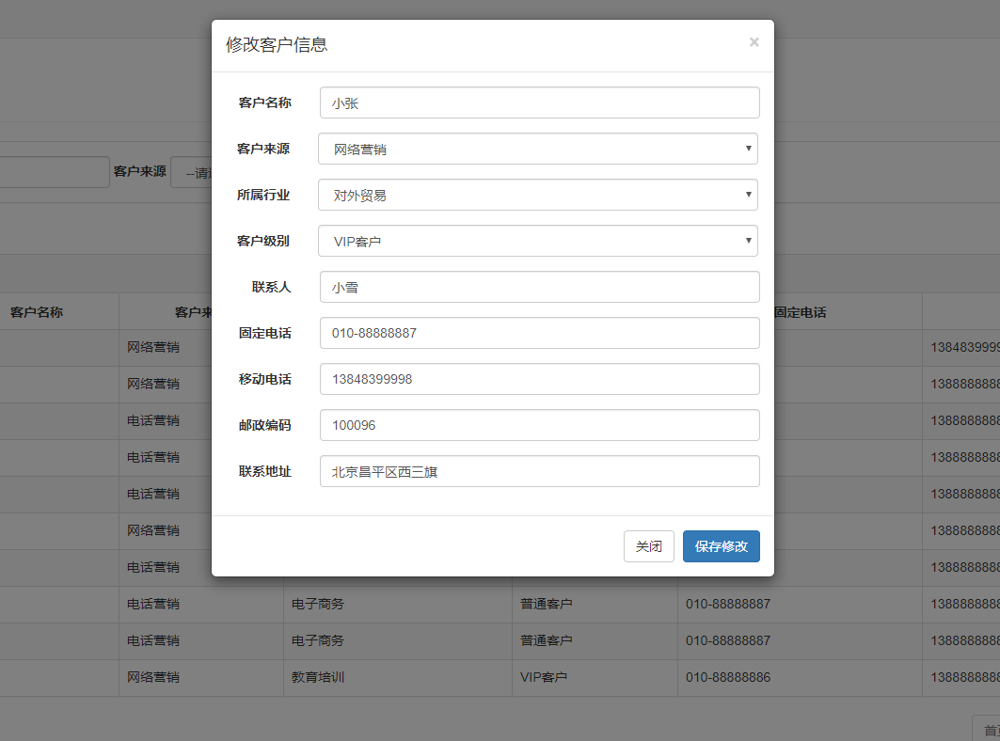

# Boot-crm ： 客户信息管理系统1.0

## 项目介绍
  &nbsp; &nbsp; 使用ssm框架编写客户信息管理系统
  
  - 使用框架：spring4+mybatis+springMVC
  
  - 数据库：mysql5.5
  
  - 编译器：Eclipse
  
## 实现功能
- 客户信息的增删改查，以及模糊查询

- 分页显示客户信息

1. 客户列表页面

2. 添加客户

3. 模糊查询

4. 信息修改

